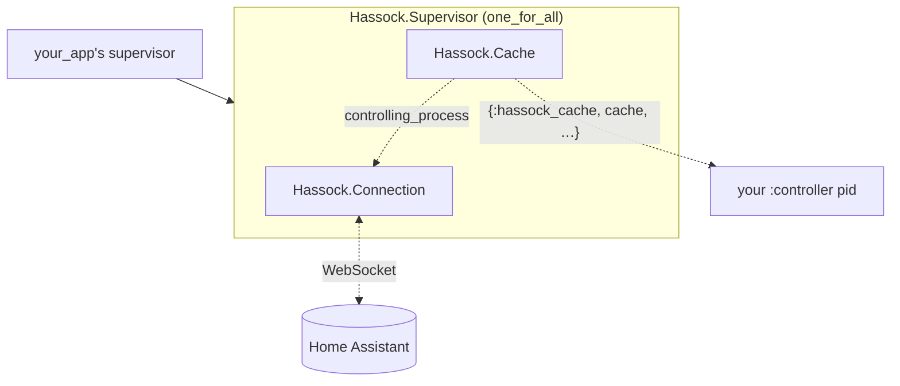

# Hassock

Home Assistant WebSocket client for Elixir.

Hassock connects to a Home Assistant instance over its WebSocket API,
authenticates, and lets your application subscribe to entity state changes,
call services, and (optionally) keep an in-memory ETS cache of the world.

It follows the controlling-process pattern from `:gen_tcp` /
`Circuits.UART`: the process that calls `start_link/1` becomes the recipient
of async messages, and ownership can be handed off explicitly with
`controlling_process/2`.

Requires Home Assistant ≥ 2022.4 if you use `Hassock.Cache`
(`subscribe_entities` was added in that release).

## Installation

```elixir
def deps do
  [
    {:hassock, "~> 0.1.0"}
  ]
end
```

## Usage

### Bare connection — for targeted subscriptions

Subscribe only to the entities (or events) you care about; do everything else
manually.

```elixir
config = %Hassock.Config{
  url: "http://homeassistant.local:8123",
  token: System.fetch_env!("HASSOCK_TOKEN")
}

{:ok, conn} = Hassock.connect(config: config)

receive do
  {:hassock, ^conn, :connected} -> :ok
end

{:ok, _sub_id} = Hassock.subscribe_entities(conn, ["light.kitchen"])

# In your handle_info/2 (or a receive loop):
#
# {:hassock, ^conn, {:event, {:entities, %{added: a, changed: c, removed: r}}}} -> ...
# {:hassock, ^conn, {:disconnected, reason}}                                    -> ...
```

> **Note:** these `changed` entries are *diffs*, not full entity states —
> each one describes only the fields that changed (state, specific attribute
> additions, specific attribute removals). It's up to your code to apply
> them against prior state if you need the complete picture. The `added`
> map (initial snapshot and any newly-created entities) does carry full
> `%Hassock.EntityState{}` structs. If you'd rather get fully-materialized
> states and old-vs-new comparisons out of the box, use `Hassock.Cache`.

To call a service:

```elixir
Hassock.call_service(conn, %Hassock.ServiceCall{
  domain: "light",
  service: "toggle",
  target: %{entity_id: "light.kitchen"}
})
```

### With an entity cache — for "show me everything" use cases

`Hassock.Cache` subscribes to every entity, holds the world in ETS, and emits
high-level change messages. Reads are direct ETS lookups — no GenServer
roundtrip.

```elixir
{:ok, conn} = Hassock.connect(config: config)
{:ok, cache} = Hassock.Cache.start_link(connection: conn)

receive do
  {:hassock_cache, ^cache, :ready} -> :ok
end

Hassock.cached_state(cache, "light.kitchen")
Hassock.cached_domain(cache, "light")
```

Cache messages:

  * `{:hassock_cache, cache, :ready}` — once, after the initial snapshot loads
  * `{:hassock_cache, cache, {:changes, %{added: _, changed: _, removed: _}}}` — per delta
  * `{:hassock_cache, cache, :disconnected}` — on socket loss (ETS retained)

> **Note on ownership:** `Hassock.Cache.start_link/1` *transfers ownership* of
> the connection to the cache. After it returns, the cache receives all
> `{:hassock, conn, …}` messages — your code talks to the cache, not the
> connection, for async events. (Synchronous calls like `call_service/2` and
> `get_states/1` still work directly on `conn`.)

### Hand off message reception

```elixir
:ok = Hassock.controlling_process(conn, other_pid)
:ok = Hassock.Cache.controlling_process(cache, other_pid)
```

Only the current controller may transfer ownership.

### Convenience supervisor

If you want a single child spec for your application's supervision tree:

```elixir
{Hassock.Supervisor,
 config: config,
 cache: true,
 controller: my_handler_pid}
```

This wires `Hassock.Connection` + `Hassock.Cache` under a `one_for_all`
supervisor and delivers cache events to `controller` (default: caller).

## Architecture

With `Hassock.Supervisor` (cache enabled), the supervision tree looks like:



Solid edges are supervision links; dashed edges are message / ownership flow.

  * **`one_for_all`** — if either child crashes, both restart from a clean
    slate. This avoids the restart-time edge cases of reclaiming the
    connection's controlling process and orphaning the old HA-side
    `subscribe_entities` subscription; on restart, a fresh auth handshake
    and fresh subscription give a pristine starting point.
  * **Ownership flow** — `Cache` calls
    `Connection.controlling_process(conn, self())` during its own init, so
    every `{:hassock, conn, …}` event lands in the cache, not the caller.
    The cache then emits higher-level `{:hassock_cache, cache, …}` messages
    to its own controller (the `:controller` pid, default: caller).
  * **Without the cache** — the Connection is a direct child of your
    supervisor (or unsupervised), and the caller receives
    `{:hassock, conn, …}` events directly.
  * **Synchronous commands** (`call_service/2`, `get_states/1`,
    `subscribe_entities/2`, …) always go directly to the Connection pid —
    they don't flow through the controlling-process channel.

## Development

```bash
mix deps.get
mix test
```

Integration tests are tagged `:integration` and skipped by default. To run
them against a live Home Assistant:

```bash
HASSOCK_URL=http://homeassistant.local:8123 \
HASSOCK_TOKEN=... \
HASSOCK_LIGHT_ENTITY=light.your_light \
mix test --include integration
```

`HASSOCK_LIGHT_ENTITY` is optional — without it, light-toggle assertions
auto-discover the first available `light.*` entity or skip.
